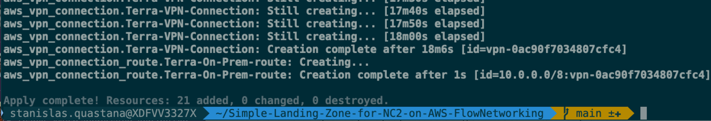

# Simple-Landing-Zone-for-NC2-on-AWS-With-S2S-VPN-TGW
This repo contains terraform code to deploy a **simple network landing zone for Nutanix Cloud Cluster (NC2) on AWS with a VPN site to site connection to On-premises Datacenter** (using an AWS Transit Gateway and AWS Site to Site VPN)

 


## Prerequisites

- Of course a VPN Gateway running on premises (or on a public cloud platform)
- All prerequisites for NC2 : https://portal.nutanix.com/page/documents/details?targetId=Nutanix-Clusters-AWS:aws-clusters-aws-requirements-c.html 
- More information about NC2 on AWS : https://portal.nutanix.com/page/documents/details?targetId=Nutanix-Clusters-AWS:aws-clusters-aws-getting-started-c.html 

- An AWS Account with enough privileges (create Role, ...)
- AWS CLI 2.28.17 or >: https://docs.aws.amazon.com/cli/latest/userguide/getting-started-install.html or https://github.com/aws/aws-cli/tree/v2  
    - [how to configure AWS CLI with your account](https://docs.aws.amazon.com/cli/latest/userguide/cli-configure-envvars.html?icmpid=docs_sso_user_portal)
- Terraform CLI 1.13 or > : <https://www.terraform.io/downloads.html>
    - [Best practices for using the Terraform AWS Provider](https://docs.aws.amazon.com/prescriptive-guidance/latest/terraform-aws-provider-best-practices/introduction.html)

You can also clone this repo in your [AWS Cloud Shell](https://docs.aws.amazon.com/cloudshell/latest/userguide/vm-specs.html) and [install terraform in your cloud shell](https://dev.to/aws-builders/how-to-install-terraform-on-aws-cloudshell-5had).

For additional information about creating manually your AWS for Nutanix Cloud Cluster : https://portal.nutanix.com/page/documents/details?targetId=Nutanix-Clusters-AWS:aws-aws-create-resources-manual-c.html


## Landing Zone architecture(s)

This landing zone is designed for an NC2 on AWS with [**Nutanix Flow Networking**](https://portal.nutanix.com/page/documents/solutions/details?targetId=TN-2028-Nutanix-Cloud-Clusters-on-AWS:flow-virtual-networking-on-aws.html) integration available in AOS 6.8 or more.

  

IP ranges can be defined/customized by editing [example-configuration.tfvars](example-configuration.tfvars). Then rename example-configuration.tfvars to configuration.tfvars

A [VPC Endpoint S3 Gateway](https://docs.aws.amazon.com/vpc/latest/privatelink/vpc-endpoints-s3.html) can be enabled to make the solution more cost effective for secure, private acces. Traffic from your VPC to S3 is routed directly via AWS’s internal network, which can result in lower latency and higher throughput compared to going through an internet gateway or NAT device.

This landing zone also include the option to have a dedicated private subnet and a virtual machine to use as a jumbox (with an Elastic Load Balancer to access it from Internet). All AWS resources related to Jumbox are in [jumbox.tf](jumbox.tf) file.


## Step by step operations

Clone this repo.

Edit [example-configuration.tfvars](example-configuration.tfvars) to define your AWS resources names or tags, your AWS region, AMI for Jumpbox Virtual Machine... Then rename example-configuration.tfvars to configuration.tfvars

 

**Important** DO NOT USE 192.168.5.0/24 CIDR that is reserved for communications between AHV and the CVM


To get these information, you can use the [AWS CLI](https://aws.amazon.com/cli/) on your workstation or in [AWS Cloud Shell](https://aws.amazon.com/cloudshell/)

You can list your AWS regions available using the following command :

```bash
aws ec2 describe-regions --output table
```
 

The following command gives the region actually used by the CLI regardless of whether environment variables are or are not set:

```bash
aws configure get region
```

Finally check your defautl AWS credential in ~/.aws/credentials

  

Check that the region and EC2 metal instance(s) you choose are supported for Nutanix Cloud Cluster : https://portal.nutanix.com/page/documents/details?targetId=Nutanix-Clusters-AWS:aws-clusters-aws-xi-supported-regions-metals.html 

If you don't need a Jumpbox VM and its associated resources, you can delete [jumbox.tf](jumbox.tf) file.

To get AMI ID  for the Windows Server Jumbox in the choosen region :

```bash
aws ec2 describe-images --region eu-central-1 --owners amazon --filters "Name=name,Values=Windows_Server-2025-English-Full-Base-*" "Name=state,Values=available" --query "Images | sort_by(@, &CreationDate) | [-1].ImageId" --output text
```

  


Before deploying check on which AWS Account you are connected :

```bash
aws sts get-caller-identity
```


1. Terraform Init phase  

```bash
terraform init
```

2. Terraform Plan phase

```bash
terraform plan --var-file=configuration.tfvars
```

3. Terraform deployment phase (add TF_LOG=info at the beginning of the following command line if you want to see what's happen during deployment)

```bash
terraform apply --var-file=configuration.tfvars
```


4. Wait until the end of deployment (It should take around 18 minutes)



5. Get the Public IP used for VPN Tunnels on the AWS VPN Gateway

On the AWS Console : 


Then use this public IP in the on-premises VPN Gateway tunnel configuration.

Example using a Unifi Gateway : 


On AWS Console, check that the VPN Tunnel is up


On your on premises VPN Gateway management UI, check VPN Tunnel Status :


6. Deploy an EC2 instance in the NC2 VPC (for example in the management subnet) to perform a connectivity test between AWS network and on-premises network


Check the Security Group defined to open network communications from on premises


Ping the EC2 instance from an on premises device and validate that VPN Site to site is up and running


7. Go to Nutanix Cloud Cluster (NC2) Portal [https://cloud.nutanix.com](https://cloud.nutanix.com) and start your Nutanix Cluster deployment wizard.

In Step 1 (**General**) choose the same AWS region and Availability Zone that you used in your terraform deployment

 

In Step 4 (**Network**) choose the VPC and Management Subnets created with terraform


In Step 6 (**Prism Central**) choose the PC Subnet and FVN (Flow Virtual Networking) subnet created with terraform

 

8. After the deployment of the cluster is successfull, you can add connectivity with on-premises or other AWS VPC or services by peering [a Transit VPC](https://docs.aws.amazon.com/whitepapers/latest/aws-vpc-connectivity-options/transit-vpc-option.html) . If you enabled a bastion and a Jumpbox VM, you can login to the Jumbox VM and connect Prism Element or Prism Central through a web browser.

9. Use the solution and configure Nutanix features like categories, VM, replication...

10. When you want to destroy the Nutanix Cluster, use the NC2 Portal (https://cloud.nutanix.com) to terminate it.

11. After Nutanix cluster terminaison, you can destroy the landing zone using the following command : 
```bash
terraform destroy --var-file=configuration.tfvars
```


## Check you AWS Console after deployment to see cloud resources created

### Network components

 

 

 


## How much does it cost to test this landing zone ?

It's very cheap to test and customize this simple landing zone.

You can use **infracost** (available on https://www.infracost.io/) to check the estimate price for 1 month. Here is an example for Ireland (eu-west-1) AWS Region without enabling EC2 Jumbox.

 

 :exclamation: Important : this landing zone cost estimation does not include the cost of AWS EC2 Metal instance(s) used as node(s) in the Nutanix Cluster and network traffic. 
 Please have a look of metal instances prices here : https://aws.amazon.com/ec2/pricing/on-demand/. Pricing is per instance-hour consumed for each instance, from the time an instance is launched until it is terminated or stopped. Each partial instance-hour consumed will be billed per-second for Linux, Windows, Windows with SQL Enterprise, Windows with SQL Standard, and Windows with SQL Web Instances, and as a full hour for all other instance types.


## Future improvements on my roadmap

- Add additional tags to every AWS resources 